As discussed in the [previous post](https://lab176344.github.io/writeup/blog/pytorch-compile), `torch.compile` can deliver significant speedups for PyTorch models, but it requires the model to be free of _graph breaks_. A graph break can add overhead by forcing the compiler to fall back to eager execution and increase the latency of the forward pass. In this post, we will discuss how to take a model we did not write in this case, RF-DETR from Roboflow and understand performance bottlenecks, identify graph breaks, and patch them to unlock the full potential of `torch.compile` and TensorRT.

## Background

To analyse the performance bottlecnecks and optimisations we will be using two models, RF-DETR Nano and YOLOv8-Small. Both are real-time object detectors optimised for speed and efficiency, but they have different architectures, RF-DETR is a transformer-based detector with a DINOv2 backbone, while YOLOv8 is a pure CNN. This makes them interesting case studies for how different optimization strategies interact with different model architectures.

This post is divided into the following sections,

1. Identifying the bottlenecks in the model forward using `torch.profiler` and chrome tracing to understand where the time is being spent in the model.
2. Identifying the graph breaks in the model using torch dynamo logging and understanding the root cause of the graph breaks.
3. Patching the graph breaks using closures to capture symbolic shapes as constants, and monkey-patching the offending functions at the module level to ensure the patches survive across `torch.compile` and ONNX export.
4. Comparing the performance of the optimised model against the baseline and understanding the impact of each optimisation strategy on the latency, throughput, and memory usage of the model.

## Where the time actually goes

Before running optimisations it is useful to understand which operations takes how much time and the overall CPU/GPU utilisation.

This can be done by analysing the forward loop with `torch.profiler`at batch size 1. For both RF-DETR Nano and YOLOv8-Small this experiment is setup with the following configuration,

```python
prof_ctx = torch.profiler.profile(
    activities=[ProfilerActivity.CPU, ProfilerActivity.CUDA],
    schedule=torch.profiler.schedule(wait=2, warmup=3, active=15, repeat=1),
    on_trace_ready=torch.profiler.tensorboard_trace_handler(str(output_dir)),
    record_shapes=True,
)
```

on a single NVIDIA A5000 GPU. The `wait`, `warmup`, and `active` parameters ensure we capture a steady-state profile after the initial setup overhead. The dataset used for the study is COCO 2017 validation, which contains 5000 images. We run the profiler on the first 15 steps of the validation loop to get a representative sample of the inference workload.

The traces are loaded into Chrome (`chrome://tracing`) for visual inspection. We also summarise them programmatically by grouping CUDA kernel names into categories.

### CPU overhead

The first thing the trace shows is that both models are heavily CPU-bound in eager mode.

| Model        | GPU kernel time | CPU dispatch time | CPU/GPU ratio |
| ------------ | --------------- | ----------------- | ------------- |
| RF-DETR Nano | 52.2 ms         | 517 ms            | 9.9x          |
| YOLOv8-Small | 41.6 ms         | 428 ms            | 10.3x         |

At batch size 1 which is common for real-time applications, the GPU is idle for roughly 90% of the wall time. The CPU is dispatching ops one at a time, each PyTorch call returns immediately but the Python interpreter overhead and CUDA launch overhead stack up across hundreds of small kernels. This can be one of the reasons `torch.compile` is effective: it records the kernel sequence once and replays it without re-entering Python on subsequent calls. As shown in the CPU/GPU timeline figure, this idle time is significant.

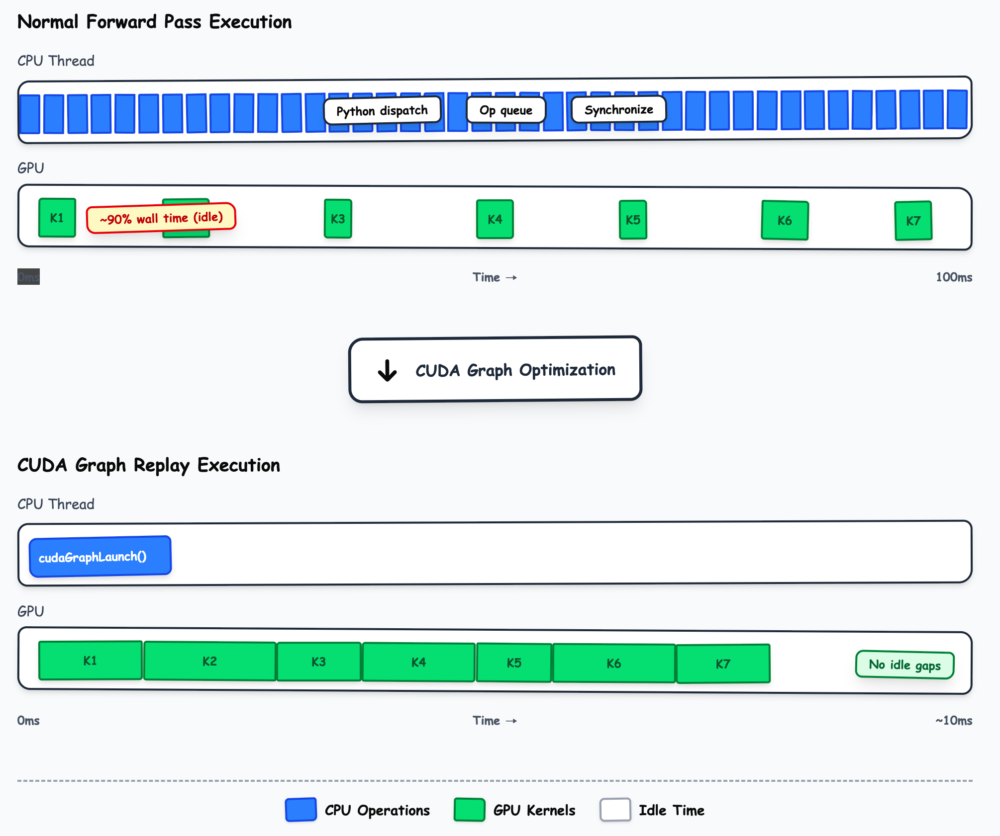

### RF-DETR Nano GPU breakdown

RF-DETR is a transformer-based architecture, so we expect to see a lot of attention and linear projection kernels. The trace confirms this,

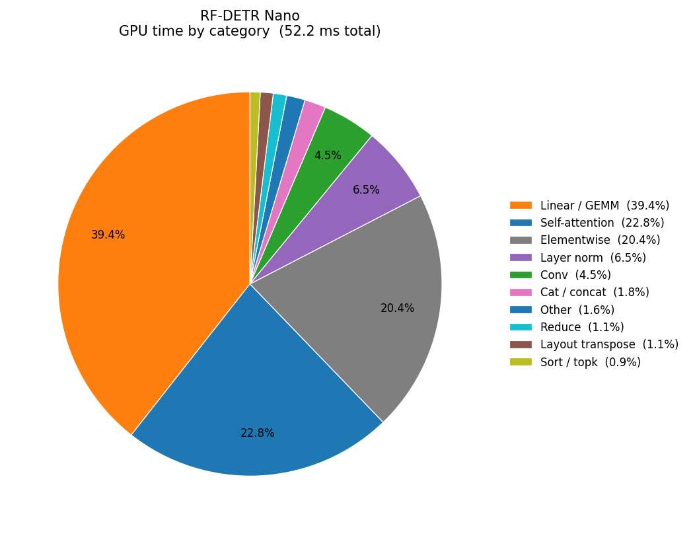

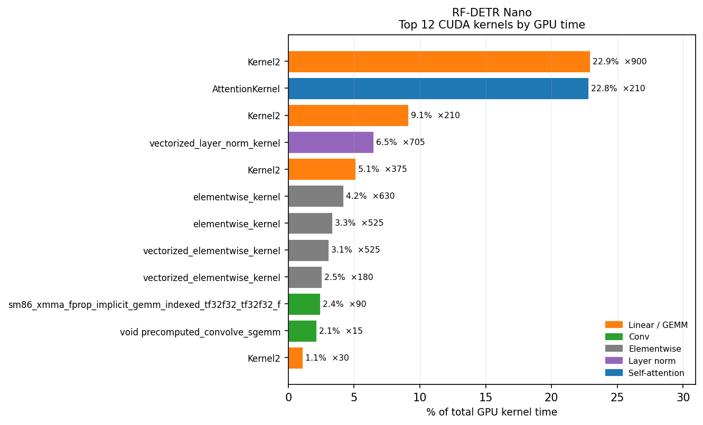

From the figure it can be seen that Linear / GEMM operations (projections inside each transformer block) account for 44% of GPU time. The memory-efficient attention kernel `fmha_cutlassF_f32_aligned` takes another 23%, this is the `scaled_dot_product_attention` path. Layer norm is 6.5%.

The top single kernel by time is `cutlass_80_tensorop_s1688gemm_64x64`, a CUTLASS matrix multiply that appears 900 times, once per linear projection call across all transformer layers and all profiled steps. At 13 µs per call it is fast individually but dominates in aggregate.

There is no convolution at all in the profile. RF-DETR's feature pyramid is built entirely from the DINOv2 ViT backbone using strided patch embeddings, so the compute profile looks nothing like a traditional CNN detector.

### YOLOv8-Small GPU breakdown

YOLOv8 is a pure CNN based on the CSPDarknet architecture. We expect to see a lot of convolution and batch norm kernels, and the trace confirms this,

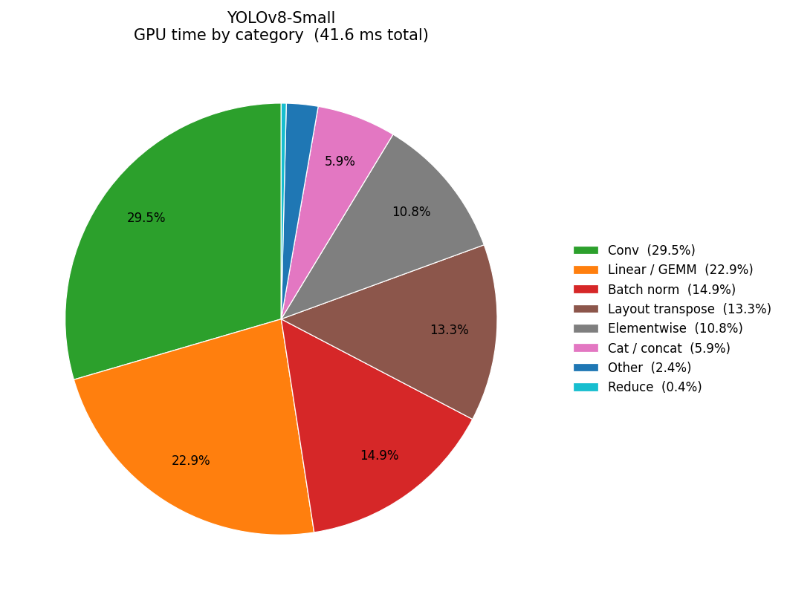

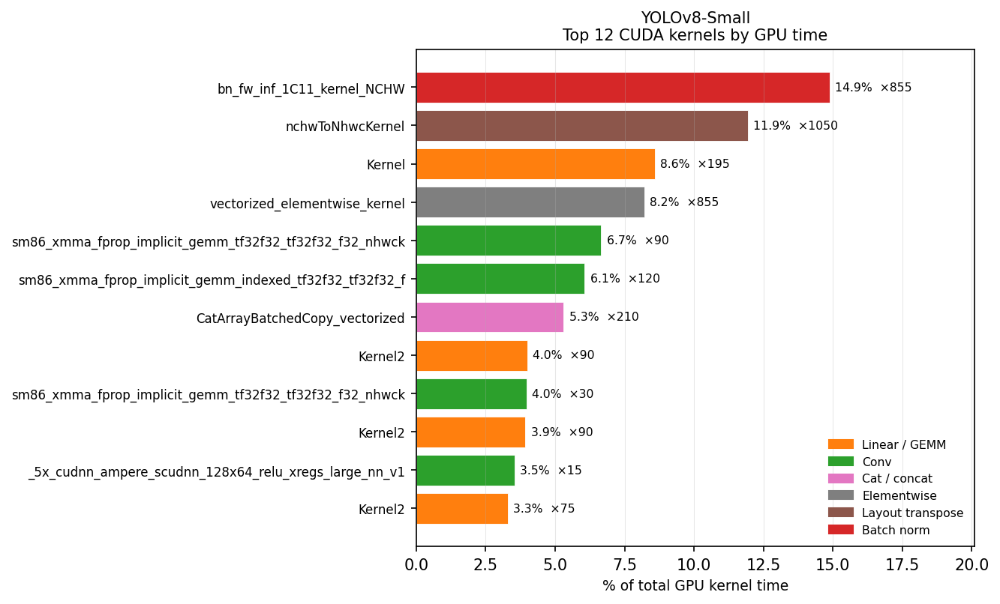

The figure shows that the top kernel is `bn_fw_inf_1C11_kernel_NCHW`, batch normalisation in NCHW layout, taking 15% of GPU time across 855 calls. The second-largest cost is `nchwToNhwcKernel` at 23% of GPU time, which is the layout conversion cuDNN performs when it picks an NHWC-optimised convolution algorithm. This is a significant overhead: nearly a quarter of GPU time is spent transposing tensors between channel-last and channel-first formats.

## Operation breakdown comparison

| Category         | RF-DETR Nano | YOLOv8-Small |
| ---------------- | ------------ | ------------ |
| Linear / GEMM    | 43.8%        | 36.5%        |
| Self-attention   | 22.8%        | ,            |
| Elementwise      | 20.4%        | 10.8%        |
| Layer norm       | 6.5%         | ,            |
| Batch norm       | ,            | 14.9%        |
| Layout transpose | 1.1%         | 22.9%        |
| Cat / concat     | 1.8%         | 5.9%         |

The profiles make it clear why the two architectures respond differently to optimizations. RF-DETR benefits from kernel fusion across its attention + projection + norm chains, exactly what we will target with `torch.compile`. YOLOv8 benefits more from eliminating the repeated layout conversions.

## Identifying graph breaks

### RF-DETR

RF-DETR's forward pass is a complex sequence of operations across multiple submodules, the DINOv2 backbone, the transformer encoder and decoder, the deformable attention modules, and the final prediction heads. Analysing with torch.dynamo explain shows that there are two graph breaks in the model, as shown in the figure below.

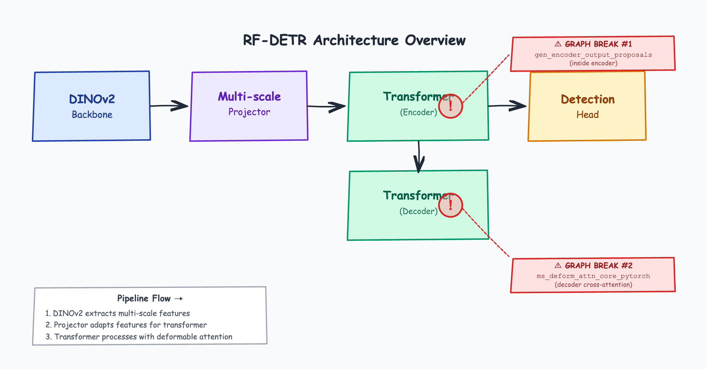

The two methods that are causing graph breaks are `gen_encoder_output_proposals` in the transformer and `ms_deform_attn_core_pytorch` in the deformable attention module.

### Break 1: Symbolic shapes in linspace

The transformer's proposal generator builds a spatial grid over each encoder feature level. The original code looks like this,

```python
for lvl, (H_, W_, ) in enumerate(spatial_shapes):
    grid_y = torch.linspace(0, H_, 1, H_, ...)
    grid_x = torch.linspace(0, W_, 1, W_, ...)
```

The spatial shapes are the mutli-level feature map sizes, which depend on the input resolution and the backbone's downsampling. They are not fixed constants in the code, so they cannot be hardcoded. The problem is `H_` and `W_` are symbolic at compile time and will be known only at runtime. TorchDynamo cannot evaluate `torch.linspace(0, H_-1, H_)` because the `steps` argument (the third positional) must be a concrete integer. It breaks the graph there.

The fix is to stop using symbolic values entirely. If the spatial shapes can be fixed for a given resolution and projector scale, we can capture them as concrete Python integers in a closure. This change can allow us to replace the `torch.linspace` calls with `torch.arange`, which does not require a symbolic size argument and can be compiled cleanly by TorchDynamo. The patched function is shown below,

```python
@staticmethod
def patch_transformer_proposals(spatial_shapes: list):
    def patched_gen_proposals(memory, memory_padding_mask,
                               spatial_shapes_tensor, learned_wh=None, unsigmoid=False):
        N_, S_, C_ = memory.shape
        proposals = []
        _cur = 0
        for lvl in range(len(spatial_shapes)):
            H_val, W_val = spatial_shapes[lvl]
            grid_y = torch.arange(H_val, device=memory.device, dtype=torch.float32)
            grid_x = torch.arange(W_val, device=memory.device, dtype=torch.float32)
            grid_y, grid_x = torch.meshgrid(grid_y, grid_x, indexing="ij")
            ...
        return memory, output_proposals.to(memory.dtype)

    transformer_mod.gen_encoder_output_proposals = patched_gen_proposals
```

The closure over `spatial_shapes` is the key. `H_val` and `W_val` are plain Python ints, TorchDynamo treats them as constants, not symbolic tensor values, so `torch.arange(H_val)` compiles cleanly.

### Break 2: Dynamic split sizes in deformable attention

The second graph break is in the deformable attention module. The function is called `ms_deform_attn_core_pytorch` and it contains a dynamic split operation that depends on same spatial shapes from the mutli-level feature map as the first break. The function splits the value tensor into a list of tensors corresponding to each feature level, and the split sizes are determined by the spatial shapes:

```python
value_list = value.split([H_*W_ for H_, W_ in value_spatial_shapes], dim=3)
```

Here `value_spatial_shapes` is a tensor. The list comprehension that builds the split sizes iterates over it, producing `PendingUnbackedSymbolNotFound`, TorchDynamo sees the sizes as backed by a tensor rather than concrete Python values, and cannot lower the split.

The same closure trick as used to patch the first break can be used here. We compute `split_sizes` before the patched function is defined, making it a constant list in the closure:

```python
@staticmethod
def patch_deformable_attention(spatial_shapes: list):
    split_sizes = [int(H) * int(W) for H, W in spatial_shapes]  # concrete list

    def patched_ms_deform_attn_core(value, value_spatial_shapes,
                                     sampling_locations, attention_weights):
        B, n_heads, head_dim, _ = value.shape
        _, Len_q, n_heads, L, P, _ = sampling_locations.shape
        value_list = value.split(split_sizes, dim=3)

    attn_func.ms_deform_attn_core_pytorch = patched_ms_deform_attn_core
    attn_functions_pkg.ms_deform_attn_core_pytorch = patched_ms_deform_attn_core
    attn_mod.ms_deform_attn_core_pytorch = patched_ms_deform_attn_core
```

### Detecting spatial shapes at runtime

Both patches need `spatial_shapes`, the height and width of each feature level the model produces. RF-DETR exposes this indirectly through a `projector_scale` attribute (e.g. `["P4"]`), which maps to a stride (`P4 → stride 16`). Given the input resolution, the spatial size at that scale is `resolution // stride`:

```python
scale_stride = {"P3": 8, "P4": 16, "P5": 32}
spatial_shapes = [
    [resolution // scale_stride[s], resolution // scale_stride[s]]
    for s in projector_scale
]
```

For `rfdetr_nano` at resolution 384 with `projector_scale=["P4"]`, this gives `[[24, 24]]`. We can do this by iteration through the model's submodules to find the `projector_scale` attribute rather than hardcoding it, so the same code works for all variants of RF-DETR regardless of their backbone or input resolution. The `apply_all` method that runs both patches looks like this,

```python
@classmethod
def apply_all(cls, model, resolution=None):
    p_scales = ["P4"]
    for m in model.modules():
        if hasattr(m, "projector_scale"):
            p_scales = list(m.projector_scale)

    spatial_shapes = [
        [resolution // scale_stride.get(s, 16),
         resolution // scale_stride.get(s, 16)]
        for s in p_scales
    ]
    cls.patch_transformer_proposals(spatial_shapes)
    cls.patch_deformable_attention(spatial_shapes)
```

Both patches are applied after `model.export()` and before `torch.compile`, `torch.jit.trace`, or the ONNX export that feeds TensorRT.

### YOLOv8

YOLOv8's graph break is simpler to handle and it is necessary only for the TensorRT path, not `torch.compile` or `torch.jit.trace`. The break is in the convolution algorithm selection logic inside cuDNN. YOLOv8's convolution layers are implemented with `torch.nn.Conv2d` in PyTorch, which calls into cuDNN for the actual convolution. CuDNN has a set of algorithms for convolution, some of which are optimised for NHWC (channel-last) layout. When the input tensor is in NCHW (channel-first) layout, cuDNN performs a layout conversion before and after the convolution, which adds overhead. The profiler shows that `nchwToNhwcKernel` is a significant cost, appearing 1050 times and consuming 23% of GPU time.

The graph break occurs because the convolution algorithm selection logic in cuDNN checks whether the input tensor is in a layout that is acceptable for the NHWC-optimised algorithms. If not, it falls back to a different algorithm that requires the layout conversion. This check is implemented in `torch.backends.cudnn.is_acceptable`, which returns `False` for NCHW tensors, causing the graph break when cuDNN tries to select an algorithm. By confirming that the NHWC layout is acceptable and desired, we can bypass this check.

The fix is to monkey-patch `torch.backends.cudnn.is_acceptable` to always return `True`, which forces cuDNN to pick the NHWC algorithms and eliminates the layout conversion overhead. This is a more aggressive patch than the RF-DETR ones because it affects all convolutions globally, but it is safe in this case because we want NHWC for all convs and the check is only used for algorithm selection, not correctness. The patch looks like this,

```python
def patch_cudnn_is_acceptable():
    import torch.backends.cudnn
    torch.backends.cudnn.is_acceptable = lambda *args, **kwargs: True
```

## How each optimization addresses the bottlenecks

The profiler gave us two clear problems to fix: CPU dispatch overhead at batch size 1, and GPU-side inefficiency from un-fused kernels and layout conversions. Each optimisation strategy attacks a different subset of these. We will focus on torch compile, jit trace which is implemented in the RF-DETR official repo, and TensorRT FP16 using torch compile.

### torch.compile (default mode)

The default compile mode runs TorchDynamo + Inductor without CUDA Graphs. Inductor analyses the FX graph and fuses sequences of pointwise ops, layer norms, and attention projections into a smaller number of Triton kernels. This directly targets the elementwise and norm overhead from the profiler, those 700+ small `vectorized_elementwise_kernel` and `layer_norm` calls get merged.

At batch size 1 the result is modest, 1.77x speedup for RF-DETR Nano, 0.88x for YOLOv8-Small (slightly slower, because YOLOv8's small kernels do not benefit as much from fusion and the compilation overhead per step still matters). At batch size 16, where GPU utilisation was already reasonable, compile without CUDA Graphs adds overhead from the repeated Python dispatch and actually regresses both models: 0.82x for RF-DETR Nano, 0.93x for YOLOv8-Small.

### torch.compile with reduce-overhead (CUDA Graphs)

`reduce-overhead` records the entire kernel sequence into a CUDA Graph on the first call and replays it directly from the driver on subsequent calls. This eliminates essentially all of the CPU dispatch overhead identified in the profiler, the 517 ms CPU overhead per 15 steps for RF-DETR and 428 ms for YOLOv8 drops to near zero.

At batch size 1 this is the single biggest PyTorch-native gain, as illustrated in the latency and throughput figures below,

| Model        | Baseline | compile         | compile + reduce_overhead | amp_bf16 + reduce_overhead |
| ------------ | -------- | --------------- | ------------------------- | -------------------------- |
| RF-DETR Nano | 12.1 ms  | 6.84 ms (1.77x) | 2.86 ms (4.23x)           | 2.04 ms (5.92x)            |
| YOLOv8-Small | 6.76 ms  | 7.69 ms (0.88x) | 2.81 ms (2.41x)           | 1.59 ms (4.25x)            |

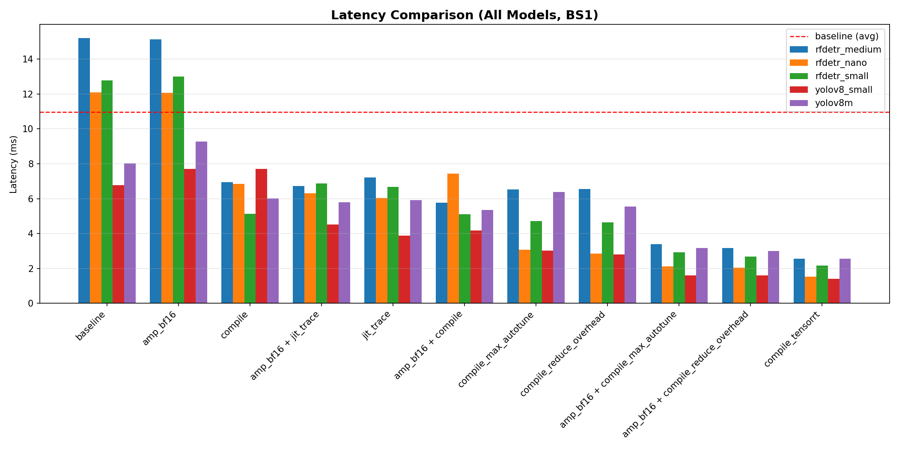

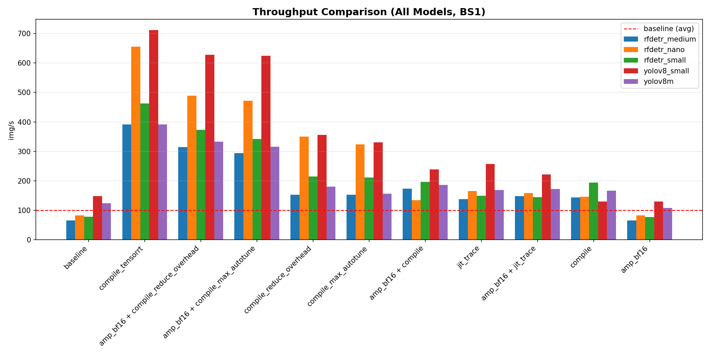

The additional gain from `amp_bf16` on top of CUDA Graphs comes from halving the data movement for the GEMM and attention kernels, BF16 tensors are half the size of FP32, so memory bandwidth becomes less of a bottleneck. RF-DETR benefits more here because it is GEMM and attention-heavy; both operations are well-suited to BF16 on Ampere.

At batch size 16 the picture reverses. CUDA Graphs require a fixed input shape, and at large batch the GPU is already well-utilised. The overhead of graph capture outweighs the dispatch saving, and `reduce-overhead` is slower than the eager baseline for both models.

### torch.compile with max-autotune

The `max-autotune` mode goes beyond simple fusion. It uses Triton to profile and select the fastest kernel configurations (tile sizes, block sizes, etc.) for the specific hardware at hand. This is particularly effective for GEMM and attention-heavy models like RF-DETR.

At batch size 1, `max-autotune` delivers substantial gains, though it is slightly behind `reduce-overhead` because it does not eliminate the CPU dispatch bottleneck as aggressively as CUDA Graphs. However, when paired with `amp_bf16`, it achieves nearly identical results to the best `reduce-overhead` paths, reaching 2.1 ms for RF-DETR Nano and 1.6 ms for YOLOv8-Small.

### jit.trace

`torch.jit.trace` records a single forward pass and freezes it as TorchScript. It eliminates Python overhead similarly to CUDA Graphs but does it at a coarser level, the entire graph is frozen, not just the kernel launch sequence. The result is consistent: 2.0x for RF-DETR Nano bs1, 1.74x for YOLOv8-Small bs1. It does not fuse kernels the way Inductor does, so it falls behind `compile + reduce_overhead` at bs1, but it is more memory-efficient than compile (149 MB vs 138-143 MB for RF-DETR Nano) and does not require the model to be graph-breakfree.

Pairing `jit.trace` with `amp_bf16` gives comparable gains to the compile paths at bs16 for RF-DETR Nano (1075 img/s vs ~588 for compile paths), primarily because `amp_bf16` halves the memory footprint of the attention and GEMM operations without needing full compilation.

### TensorRT FP16

TensorRT addresses both bottlenecks simultaneously and more aggressively than any torch-native path.

**GPU kernels:** TensorRT's layer fusion at engine build time collapses entire sub-graphs. For RF-DETR, the attention + projection + norm chain that appears as 5-6 separate CUDA kernels in the profiler becomes a single fused kernel in the engine. For YOLOv8, TensorRT chooses a consistent NHWC layout at build time, eliminating the `nchwToNhwcKernel` calls that consumed 23% of GPU time in the baseline, those 1050 layout conversion calls simply disappear.

**CPU dispatch:** The engine's `execute_v2` call is a single blocking CUDA call. All kernel scheduling happens inside TensorRT's runtime, completely outside Python. The CPU dispatch overhead visible in the profiler is irrelevant.

**FP16:** The engine is built in FP16 throughout (`CreateConfig(fp16=True)`), narrowing all tensors rather than just the ones BF16 naturally covers.

The combined effect at batch size 1 as shown in the latency and throughput figures,

| Model        | Baseline | best compile path | compile_tensorrt | speedup vs compile |
| ------------ | -------- | ----------------- | ---------------- | ------------------ |
| RF-DETR Nano | 12.1 ms  | 2.04 ms           | 1.53 ms          | 1.33x              |
| YOLOv8-Small | 6.76 ms  | 1.59 ms           | 1.40 ms          | 1.14x              |

At batch size 16 the gap widens because TensorRT's fused engines scale better with batch, more work per launch amortises the fixed kernel overhead, as seen in the latency and throughput comparison figures below,

| Model        | Baseline bs16 | best compile bs16 | compile_tensorrt bs16 |
| ------------ | ------------- | ----------------- | --------------------- |
| RF-DETR Nano | 491 img/s     | 588 img/s         | 1442 img/s            |
| YOLOv8-Small | 504 img/s     | 740 img/s         | 1489 img/s            |

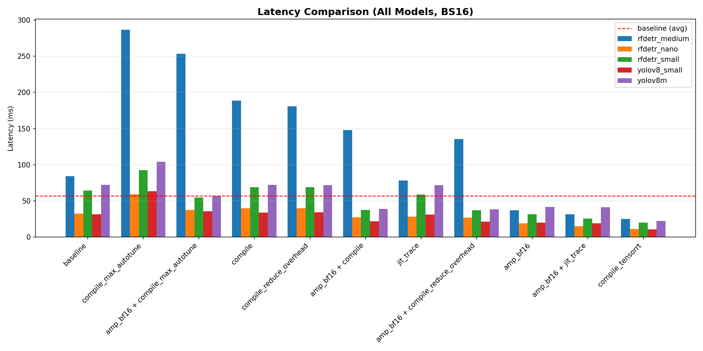

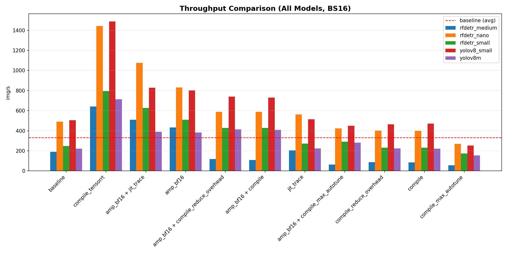

The memory story is also notable, as shown in the memory usage figures below. TensorRT runs the RF-DETR Nano engine in 117 MB versus 152 MB for the eager baseline and up to 545 MB for compile paths. For YOLOv8-Small: 43-250 MB for TRT versus 106-999 MB for eager. The engine pre-allocates exactly what it needs and nothing more.

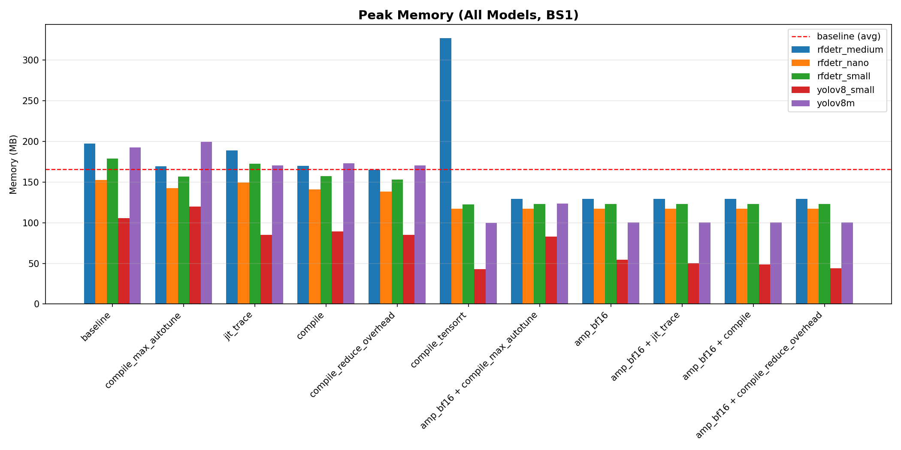

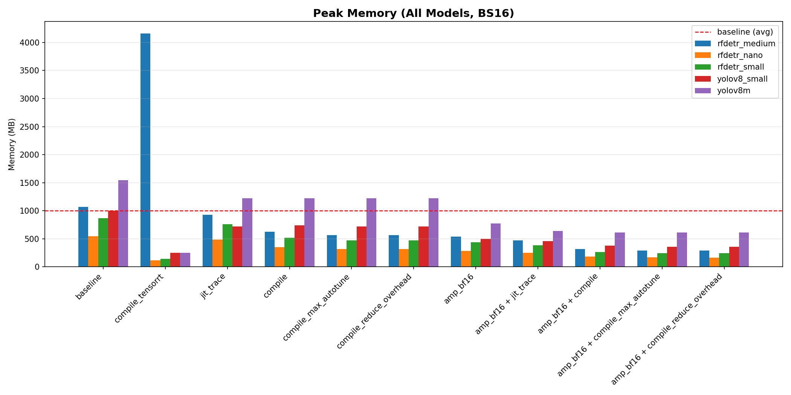

### Why compile regresses at batch 16

The profiler showed that at bs1, the CPU/GPU ratio is ~10x, making dispatch the dominant cost. At bs 16, the GPU does 16x more work per launch, so the ratio drops and the GPU is more saturated. CUDA Graphs and Inductor fusion matter less when the GPU is already busy. What matters then is raw kernel throughput, and TensorRT's engine kernels, selected at build time via exhaustive auto-tuning, are consistently faster than the default Triton kernels Inductor emits. This is why `compile_max_autotune` (which also runs a tuning pass) narrows the gap slightly at bs16 for YOLOv8 but is still 3x slower than TRT.

## Full results

| Model        | Optimisation                     | BS  | Latency | Throughput   | Speedup | Memory |
| ------------ | -------------------------------- | --- | ------- | ------------ | ------- | ------ |
| RF-DETR Nano | baseline                         | 1   | 12.1 ms | 82.6 img/s   | 1.00x   | 152 MB |
| RF-DETR Nano | compile_reduce_overhead          | 1   | 2.86 ms | 350.0 img/s  | 4.23x   | 138 MB |
| RF-DETR Nano | compile_max_autotune             | 1   | 3.03 ms | 330.0 img/s  | 4.00x   | 138 MB |
| RF-DETR Nano | amp_bf16_compile_reduce_overhead | 1   | 2.04 ms | 489.4 img/s  | 5.92x   | 117 MB |
| RF-DETR Nano | amp_bf16_compile_max_autotune    | 1   | 2.10 ms | 476.2 img/s  | 5.76x   | 117 MB |
| RF-DETR Nano | compile_tensorrt                 | 1   | 1.53 ms | 655.4 img/s  | 7.93x   | 117 MB |
| RF-DETR Nano | baseline                         | 16  | 32.6 ms | 491.0 img/s  | 1.00x   | 545 MB |
| RF-DETR Nano | amp_bf16_jit_trace               | 16  | 14.9 ms | 1075.0 img/s | 2.19x   | 248 MB |
| RF-DETR Nano | compile_tensorrt                 | 16  | 11.1 ms | 1442.1 img/s | 2.94x   | 117 MB |
| YOLOv8-Small | baseline                         | 1   | 6.76 ms | 147.9 img/s  | 1.00x   | 106 MB |
| YOLOv8-Small | compile_reduce_overhead          | 1   | 2.81 ms | 355.7 img/s  | 2.41x   | 85 MB  |
| YOLOv8-Small | compile_max_autotune             | 1   | 3.01 ms | 332.2 img/s  | 2.25x   | 85 MB  |
| YOLOv8-Small | amp_bf16_compile_reduce_overhead | 1   | 1.59 ms | 628.1 img/s  | 4.25x   | 44 MB  |
| YOLOv8-Small | amp_bf16_compile_max_autotune    | 1   | 1.62 ms | 617.3 img/s  | 4.17x   | 44 MB  |
| YOLOv8-Small | compile_tensorrt                 | 1   | 1.40 ms | 712.1 img/s  | 4.82x   | 43 MB  |
| YOLOv8-Small | baseline                         | 16  | 31.7 ms | 504.3 img/s  | 1.00x   | 999 MB |
| YOLOv8-Small | amp_bf16_compile_reduce_overhead | 16  | 21.6 ms | 740.0 img/s  | 1.47x   | 359 MB |
| YOLOv8-Small | compile_tensorrt                 | 16  | 10.7 ms | 1488.8 img/s | 2.95x   | 250 MB |

As shown in the figures below, mAP is unchanged across all optimization paths (0.484 for RF-DETR Nano, 0.443 for YOLOv8-Small). The patches and export paths are numerically equivalent to eager inference.

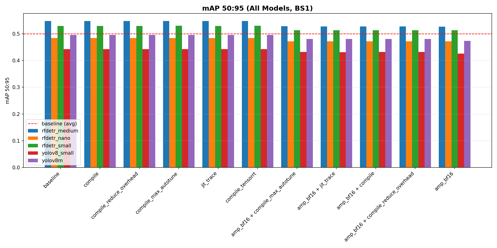

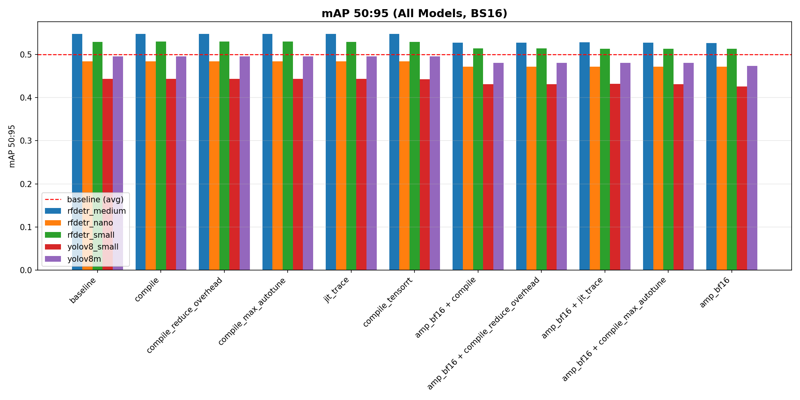

## Summary: The Best Path Forward

Based on the empirical results, the optimal optimisation strategy depends on your deployment target and batch size:

- **For RF-DETR Nano:** **TensorRT** is the absolute fastest, achieving 1.53ms (BS1) and a massive 1442 img/s (BS16). If you must stay within a pure PyTorch environment for BS1, **`amp_bf16` + `reduce-overhead`** (2.04ms) is the best choice, effectively neutralizing the CPU dispatch bottleneck.
- **For YOLOv8-Small:** **TensorRT** remains the top performer at 1.40ms (BS1) and 1489 img/s (BS16). For native PyTorch real-time use (BS1), **`amp_bf16` + `reduce-overhead`** (1.59ms) provides the lowest latency.
- **High Throughput vs. Low Latency:** For production workloads at high batch sizes (BS16), TensorRT's fused engines are unmatched. For real-time applications (BS1), `torch.compile` with CUDA Graphs (reduce-overhead) provides a compelling alternative that is nearly as fast as TensorRT but significantly easier to integrate into existing Python pipelines.

The patches are pure monkey-patches at the module level, no changes to the RF-DETR source, no subclassing, no `MethodType` wrapping. They survive across `torch.compile` recompilations and ONNX export because they operate on the Python callables before any tracing begins.

---

_Code from this study is at [optimization_study](https://github.com/moiiai-tech/optimization_study). The pytorch.compile internals referenced here are covered in more depth in [PyTorch Compile, A Deep Dive](https://lab176344.github.io/writeup/blog/pytorch-compile)._
